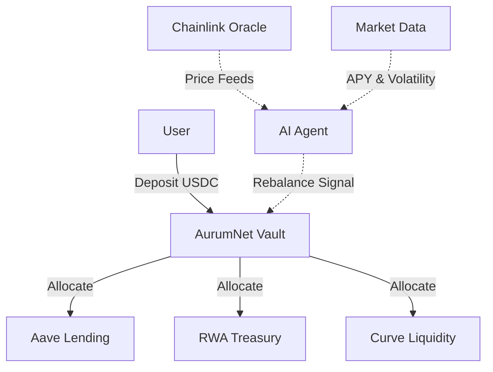
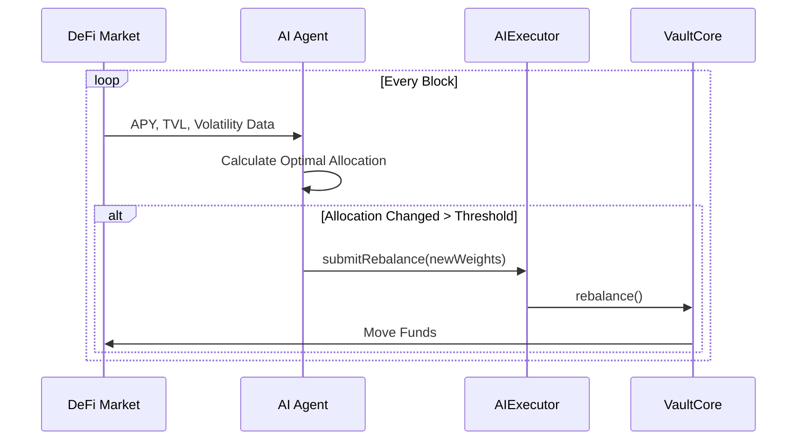
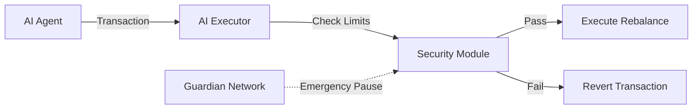

# Core Concepts of AurumNet

AurumNet represents a paradigm shift in DeFi capital allocation, moving from manual, static strategies to dynamic, AI-driven optimization. This document outlines the fundamental concepts that power the protocol.

## 1. The Autonomous Vault
At the heart of AurumNet is the **Autonomous Vault**. Unlike traditional ERC-4626 vaults that rely on hardcoded strategies or manual governance updates, AurumNet vaults are permissioned to accept signals from an off-chain AI Agent.

### Key Characteristics:
- **Non-Custodial**: Users retain ownership of their shares.
- **AI-Managed**: Rebalancing is triggered by algorithmic signals.
- **Multi-Strategy**: Can allocate to multiple underlying protocols (Aave, Compound, RWA) simultaneously.

## 2. The AI Agent (The "Brain")
The AI Agent is an off-chain Python-based system that continuously monitors the DeFi ecosystem. It is not just a bot; it is a risk-aware decision engine.

### Responsibilities:
1.  **Market Surveillance**: Polls APYs, liquidity depth, and volatility metrics every block.
2.  **Strategy Optimization**: Calculates the optimal portfolio weightings (e.g., 60% RWA, 40% Aave) to maximize Sharpe Ratio.
3.  **Execution**: Submits transactions to the `AIExecutor` contract to rebalance the vault.

## 3. Real-World Assets (RWA)
AurumNet bridges the gap between on-chain liquidity and off-chain stability. By integrating tokenized Treasury bills and corporate bonds, AurumNet provides a "risk-free rate" baseline that crypto-native strategies often lack.

- **Stability**: Uncorrelated with crypto market volatility.
- **Yield**: Consistent yield derived from traditional finance markets.
- **Liquidity**: Managed via secondary market pools.

## 4. Security & Guardians
Automation introduces new risks. AurumNet mitigates these with a **Guardian Network**.

- **Emergency Pause**: If the AI Agent behaves erratically (e.g., attempting to move 100% of funds to a low-liquidity pool), the Guardian contract can freeze operations.
- **Timelocks**: Major strategy changes or upgrades require a 48-hour delay.
- **Slippage Protection**: Hardcoded limits on how much value can be lost during a rebalance.

